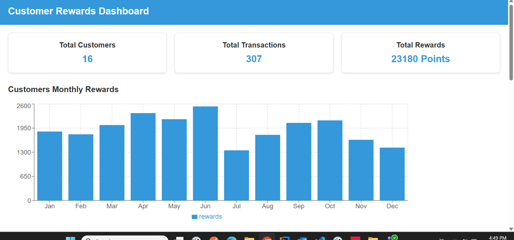
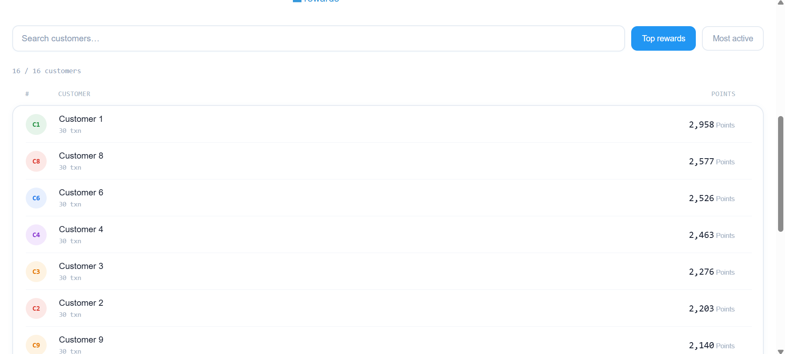
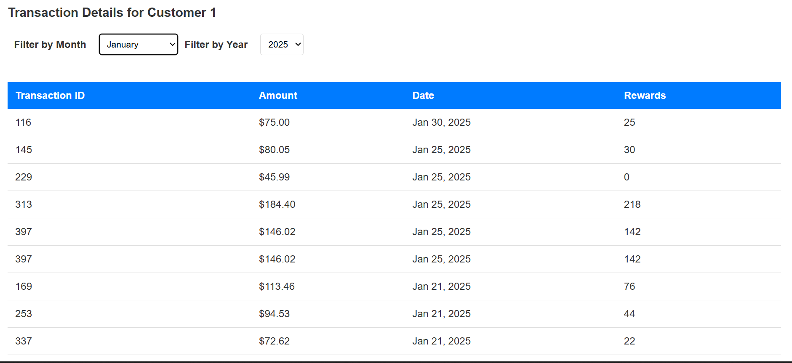
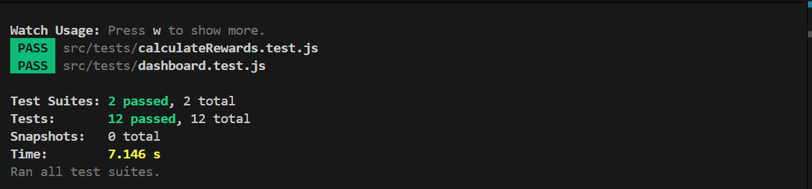

# Customer Rewards Dashboard

A React.js web application that calculates and displays reward points for customer transactions. The app processes transaction data, computes reward points per customer, and presents them through a modern leaderboard-style dashboard with data visualization and filtering capabilities.

## Table of Contents

- [Project Overview](#project-overview)
- [Technologies Used](#technologies-used)
- [Approach](#approach)
- [Key Components](#key-components)
- [Features](#features)
- [Installation](#installation)
- [Usage](#usage)
- [Screenshots](#screenshots)
- [Testing](#testing)

---

## Project Overview

The Customer Rewards Dashboard tracks customer transactions and dynamically calculates reward points based on purchase amounts. Key highlights include:

- **Leaderboard Stack View**: Customers are ranked by total reward points or transaction activity in a stacked row layout — each row shows rank, avatar, a relative progress bar, tier badge, and point total at a glance.
- **Tier Classification**: Customers are automatically classified into Platinum, Gold, Silver, or Bronze tiers based on their share of the highest reward total.
- **Customer Summary**: Selecting a customer collapses other rows and reveals a monthly breakdown table for that customer.
- **Monthly Details Table**: Breaks down reward points by month — amount spent and points earned per period.
- **Last Three Months View**: Highlights cumulative rewards and month-by-month transaction details for the most recent three consecutive months.
- **Data Visualization**: Bar chart of monthly reward totals across all customers for trend analysis.
- **Lazy Loading**: The leaderboard loads customers in chunks as you scroll — no pagination needed.
- **Dynamic Calculations**: Reward points update in real time as new transaction data is introduced.
- **Filtering and Sorting**: Sort by top rewards or most active customers; filter by customer ID via search.

---

## Technologies Used

- **React.js (v19)** — component-based UI
- **styled-components** — CSS-in-JS styling with scoped, dynamic styles per component
- **Chart.js / React-chartjs-2** — bar chart for monthly rewards visualization
- **PropTypes** — runtime prop type validation
- **ESLint + Prettier** — code linting and formatting
- **Babel** — transpilation of modern JavaScript and JSX
- **Jest + React Testing Library** — unit and integration testing

---

## Approach

**Reward Calculation** — each transaction amount maps to a point value via `calculateRewards`. Points are aggregated per customer across all transactions.

**Leaderboard Layout** — rather than a flat table, customers are displayed as stacked rows inside a single bordered container. Each row uses a 5-column grid: rank · avatar · name + progress bar · tier · points. A left-border accent highlights the selected row.

**Tier Assignment** — tiers (Platinum / Gold / Silver / Bronze) are derived dynamically by comparing each customer's total against the current maximum, so rankings shift as data changes.

**Lazy Loading** — an `IntersectionObserver` watches a sentinel element below the list. When it enters the viewport, the next chunk of rows is appended. This replaces pagination entirely and keeps the scroll experience fluid.

**Component Separation** — styles, row logic, and grid orchestration are split across three dedicated files (`rewardsRowStyles.js`, `rewardsCard.js`, `customerGrid.js`) for maintainability and reuse.

**Optimization** — `useMemo` is used only where computation is genuinely expensive: building the full customer list from raw transactions, and filtering + sorting that list. Cheap derivations (`maxPts`, `visible`, `hasMore`) are computed inline. `React.memo` wraps `CustomerRow` to prevent re-renders when unrelated state (e.g. `visCount`) changes.

---

## Key Components

```
src/
├── index.js                          # App entry point
├── App.js                            # Root 
├── App.css
├── index.css
├── components/
│   ├── dashboard.js                  # Main dashboard layout and stat cards
│   ├── customerGrid.js               # Leaderboard grid — search, sort, lazy load orchestration
│   ├── rewardsCard.js                # Single leaderboard row (avatar, points)
│   ├── transactionTable.js           # Detailed transaction list for a selected customer
│   ├── rewardDetails.js              # Monthly reward breakdown for a selected customer
│   └── filters.js                    # Filter/sort controls
├── constant/
│   └── constant.js                   # App-wide constants (DATA_URL, etc.)
├── hooks/
│   └── useFetchTransactions.js       # Custom hook for fetching transaction data
├── loggers/
│   └── index.js                      # Logger utility
├── styles/
│   ├── customerGridStyles.js         # styled-components for CustomerGrid
│   ├── dashboardStyles.js            # styled-components for Dashboard
│   ├── filtersStyles.js              # styled-components for Filters
│   ├── globalStyles.js               # Global base styles
│   ├── rewardsRowStyles.js           # styled-components for RewardsCard (StackList, Row, Avatar, etc.)
│   └── tableStyles.js                # styled-components for TransactionTable
├── tests/
│   ├── calculateRewards.test.js      # Unit tests for reward calculation logic
│   └── dashboard.test.js             # Integration tests for Dashboard component
└── utils/
    └── calculateRewards.js           # Core reward point calculation logic
```

---

## Features

- **Leaderboard Stack** — ranked rows with avatar, progress bar, tier badge, and points; selected row highlighted with a blue left-border accent
- **Tier Badges** — Platinum / Gold / Silver / Bronze dynamically assigned per customer
- **Lazy Loading** — `IntersectionObserver`-based infinite scroll; loads 5 rows per chunk
- **Search** — filter customers by ID in real time
- **Sort** — toggle between "Top rewards" and "Most active" with a single click
- **Dashboard Stat Cards** — total customers, total transactions, and total points at a glance
- **Monthly Bar Chart** — visual breakdown of reward points earned each month across all customers
- **Monthly Breakdown Table** — per-customer view of monthly spend and points
- **Last Three Months Summary** — focused view of recent transaction and reward activity
- **Responsive Design** — adapts across desktop and mobile screen sizes

---

## Installation

1. Clone the repository:

```bash
git clone https://github.com/haroonnisar111/customer-rewards-dashboard.git
cd customer-rewards-dashboard
```

2. Install dependencies:

```bash
npm install
```

3. Start the development server:

```bash
npm start
```

The app will be available at `http://localhost:3000`.

---

## Usage

1. **Dashboard** — view the summary cards (total customers, transactions, points) and the monthly rewards bar chart.
2. **Leaderboard** — browse all customers ranked by reward points or transaction count. Use the search bar to filter by customer ID.
3. **Select a Customer** — click any row to highlight it and open the monthly breakdown and transaction detail views for that customer.
4. **Lazy Scroll** — scroll to the bottom of the leaderboard to automatically load the next batch of customers.
5. **Sort** — switch between "Top rewards" and "Most active" using the toolbar buttons.

---

## Screenshots

### Dashboard Overview



### Customer Leaderboard Stack



### Monthly Rewards Chart



---

## Testing

Unit tests cover reward calculation logic and the dashboard component using Jest and React Testing Library.

```bash
npm test
```

| Test file | Coverage |
|---|---|
| `calculateRewards.test.js` | Core reward point calculation logic |
| `dashboard.test.js` | Dashboard component rendering and integration |

